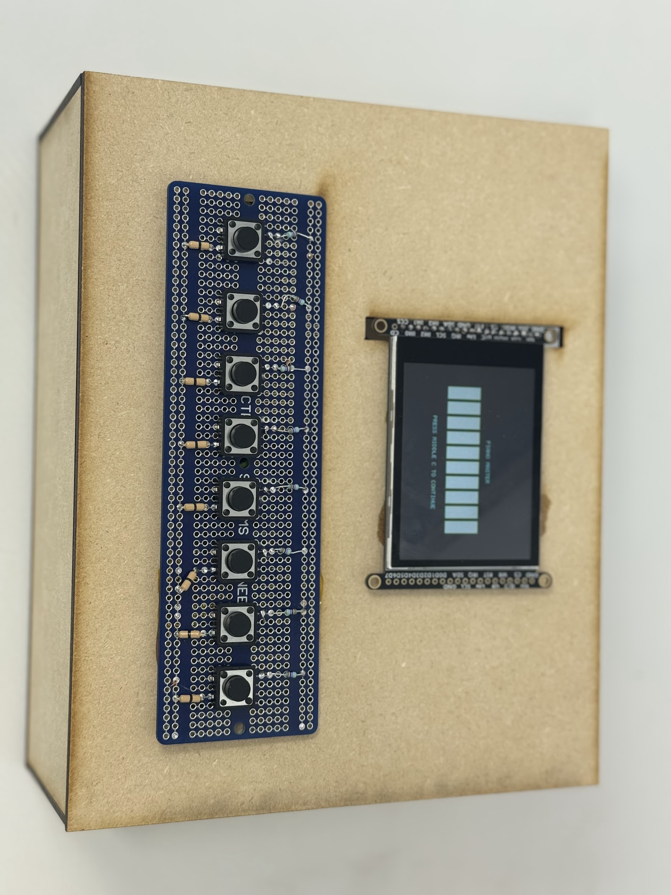
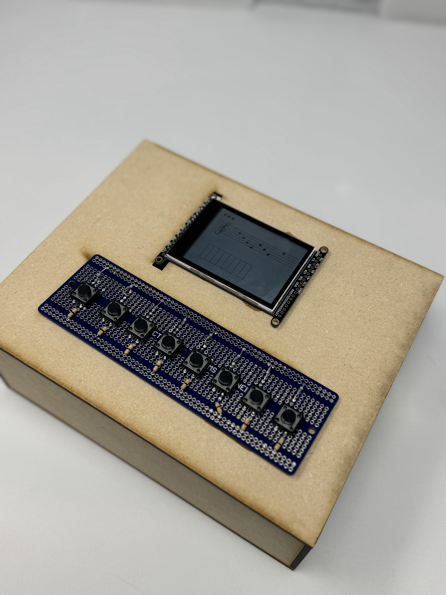
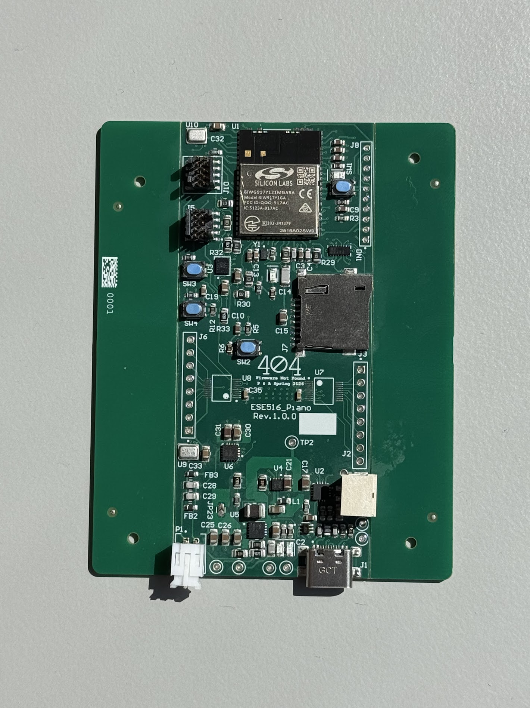
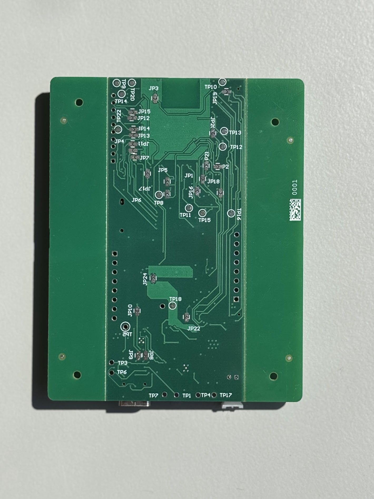
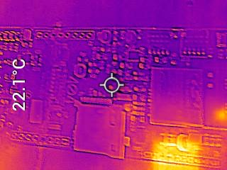
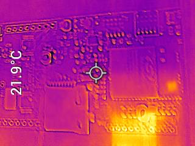
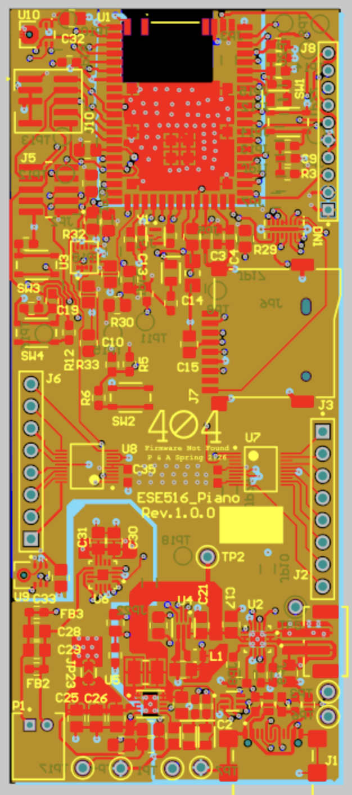
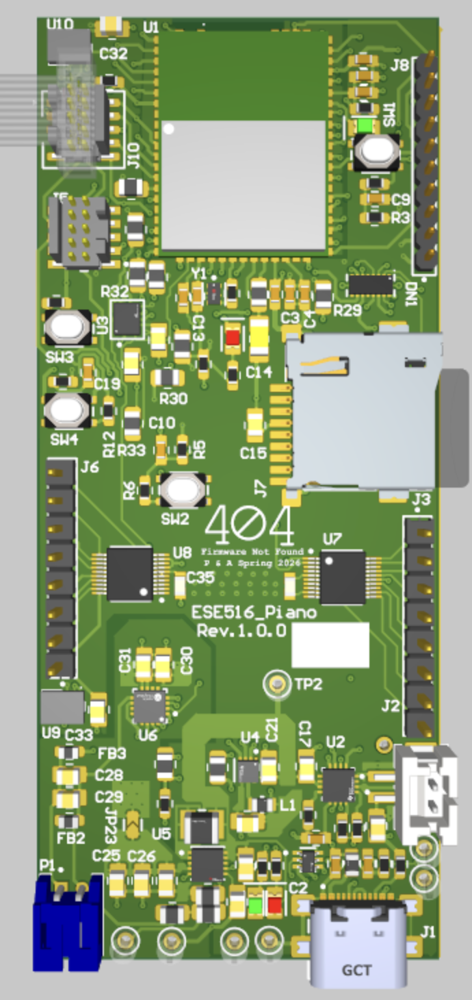
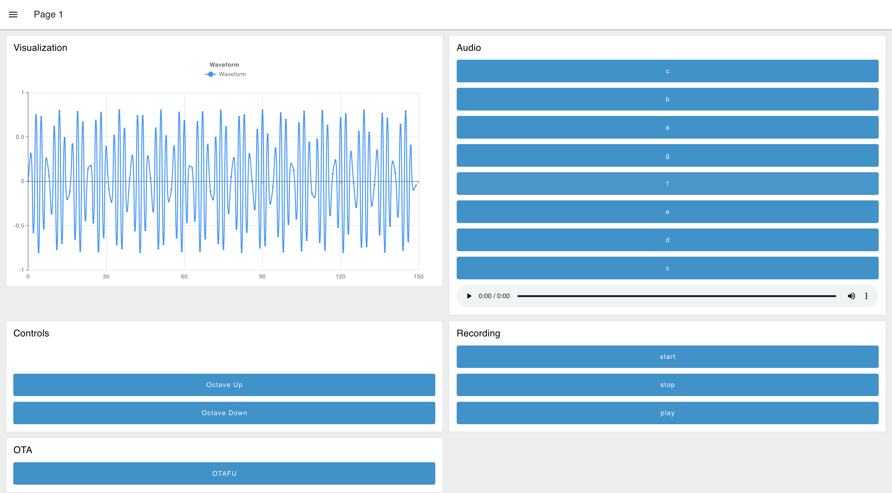
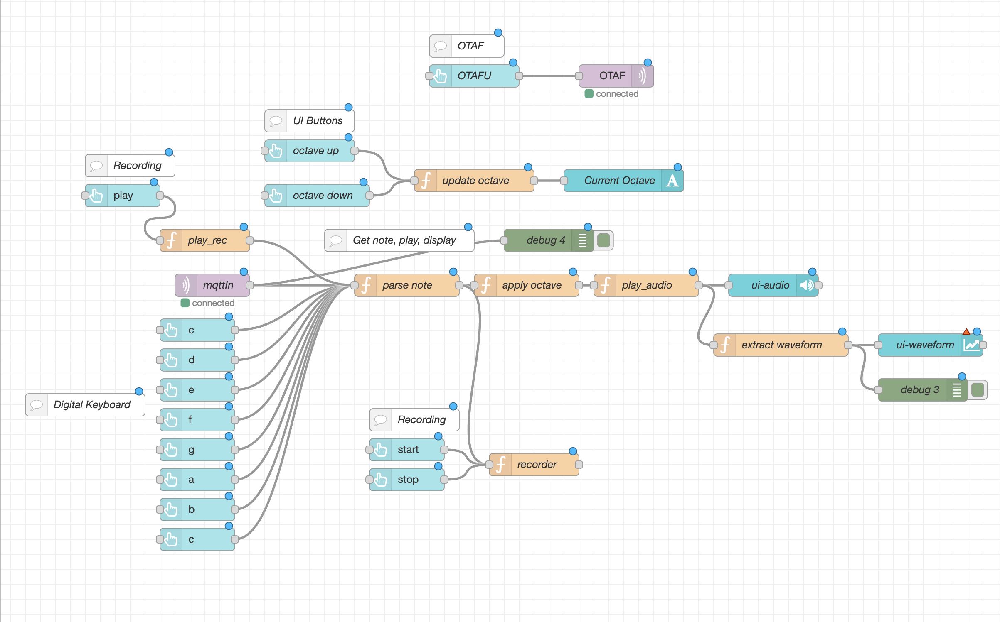

# a11g-final-submission

**Team Number: 06**

**Team Name: 404 Firmware Not Found**

| Team Member Name  | Email Address          | GitHub Username |
| ----------------- | ---------------------- | --------------- |
| Praise Ndlovu     | praisen@seas.upenn.edu | pbn107          |
| Anjali Jathavedam | apjath@seas.upenn.edu  | apjath          |

## 1. Video Presentation

Link

## 2. Project Summary

The DSPiano is a compact, multi-functional piano that allows users to play notes in a four octave range, displays the waveform of each note, and record their tune if desired. Users are able to play in free-play mode, or learn how to play sheet music.

## 3. Hardware & Software Requirements

## 4. Project Photos & Screenshots

## 5. Codebase

Do *not* commit any of your source code to this repository. Rather, provide links to the other GitHub repository you've already been using with your firmware.

- A link to your final embedded C firmware codebases
- A link to your Node-RED dashboard code
- Links to any other software required for the functionality of your device
